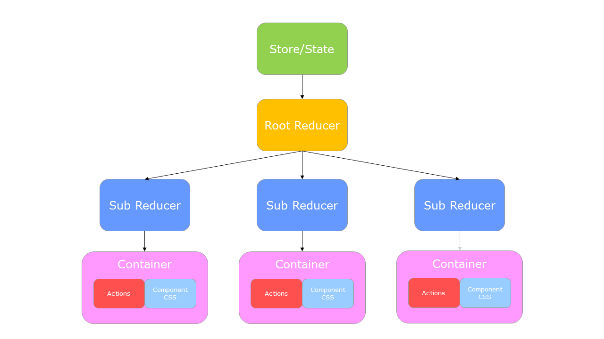

# How to install #

1. Clone the repo using "git clone &lt;repo&gt;" to your destination folder.
2. Use `npm install` to install all dependencies and modules for the project.
3. Use `npm start` to run the application on [http://localhost:3000](http://localhost:3000)

 > `Note` You need to have the [Node.js](https://nodejs.org/en/) with npm installed.

 ## Project design ##

#### Design Structure ####

#### Framwork ####

The project is using the [React](https://reactjs.org/) framework with [Redux](https://redux.js.org/introduction/getting-started) as state manager.

For design the project uses [Bootstrap](https://getbootstrap.com/) for easy-to-work-with basic React components for a simble but modern look.

#### Personal Opinion ####

To start with, the google-maps-react component was a little hard to understand in the beginning, especialy how the child components of the actual google map components worked. But after a lot of searching forums i figured it out.

React is a very logical and easy to understand framework for javascript development and if you get to understand Redux with it, it get alot more streamlined in my opninion. Redux makes it even more like object oriented programming liek Java or C# where the components in React becomes like classes in Java/C#.

Bootstrap is very nice to work with since it contains a lot of very nice components for everyday use like tables and modals for the popup functionality. But it also inculdes the design od the components like buttons which gives a more modern look if you don't want to do it all from scratch.

This project was bootstrapped with [Create React App](https://github.com/facebook/create-react-app).
